## Лабораторная Работа №1. Основы HTTP.

### Задание №1. Анализ HTTP-запросов
1. #### Зайдите на сайт http://sandbox.usm.md/login.  
   Вводим необходимый URL-адрес в поисковую строку и оказываемся на нужном нам сайте:   
     

2. #### Откройте вкладку Network в инструментах разработчика браузера.   
     

3. #### Введите неверные данные для входа (например, username: student, password: studentpass).   
   Вводим в поля формы неверные данные и наблюдаем результат:   
     

4. #### Проанализируйте запросы, которые были отправлены на сервер.  
   Как видно на рисунке ниже, был отправлен 1 запрос на сервер, который завершился неудачно. Также указан payload, который отправлялся в запросе:   
     

5. #### Ответьте на следующие вопросы:  
   * ##### Какой метод HTTP был использован для отправки запроса?  
     Для отправки запроса был использован метод POST   
   * ##### Какие заголовки были отправлены в запросе?  
     В запросе были отправлены следующие заголовки:   
       
   * ##### Какие параметры были отправлены в запросе?  
      В запросе были отправлены 2 параметра: username, password   
       
   * ##### Какой код состояния был возвращен сервером?  
     Сервер возвратил код состояния 401 Unauthorized   
       
   * ##### Какие заголовки были отправлены в ответе?  
     В ответе были отправлены следующие заголовки:   
       

6. #### Повторите шаги 3-5, введя верные данные для входа (username: admin, password: password):  
   Вводим в поля формы верные данные и наблюдаем результат:   
   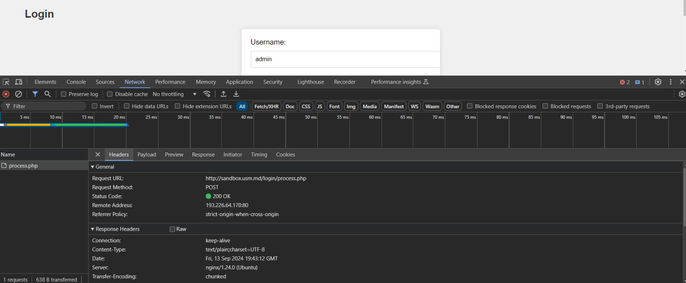  
   На рисунке выше видно, что запрос выполнился успешно и вернул статус OK. На рисунке ниже указан payload, который отправлялся в запросе:   
   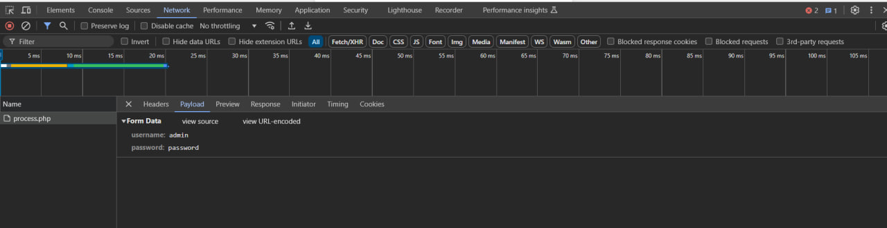   

   * ##### Какой метод HTTP был использован для отправки запроса?  
     Для отправки запроса был использован метод POST   
   * ##### Какие заголовки были отправлены в запросе?  
     В запросе были отправлены следующие заголовки:   
     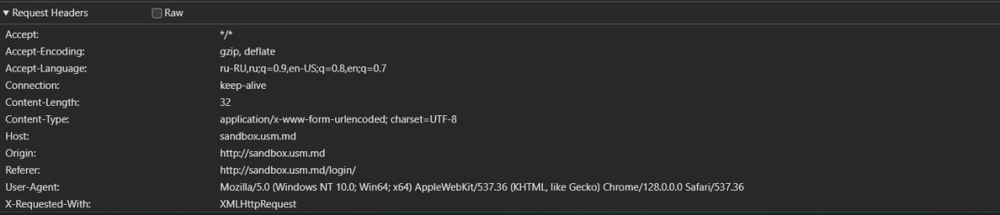  
   * ##### Какие параметры были отправлены в запросе?  
      В запросе были отправлены 2 параметра: username, password   
     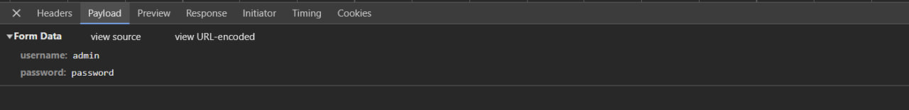  
   * ##### Какой код состояния был возвращен сервером?  
     Сервер возвратил код состояния 200 OK   
     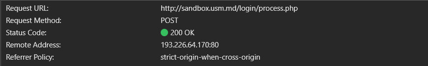  
   * ##### Какие заголовки были отправлены в ответе?  
     В ответе были отправлены следующие заголовки:   
     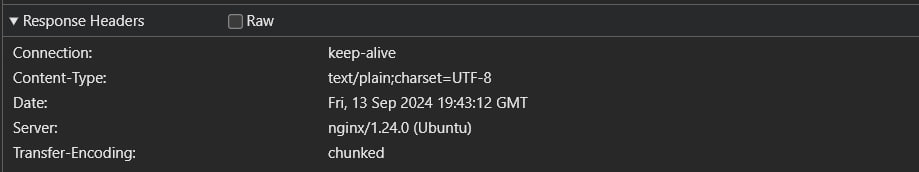   
   
### Задание №2. Составление HTTP-запросов
1. #### Составьте GET-запрос к серверу по адресу http://sandbox.com, указав в заголовке User-Agent ваше имя и фамилию.  
   Запрос составляем в приложении POSTMAN, который предоставляет удобные инструменты для реализации подобных задач. В методе запроса выбираю метод GET и в адресной строке ввожу необходимый мне адрес (http://sandbox.com), 
   далее в разделе Headers, добавляю заголовок User-Agent со значением      Melnic Ivan :   
   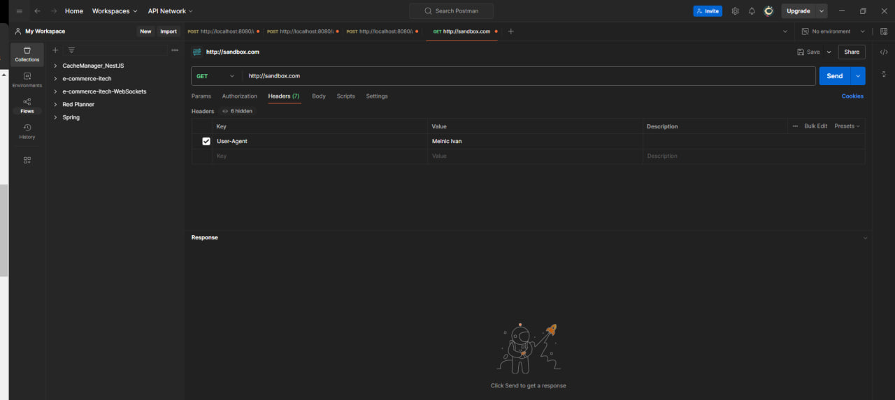   

2. #### Составьте POST-запрос к серверу по адресу http://sandbox.com/cars, указав в теле запроса следующие параметры:
   * make: Toyota
   * model: Corolla
   * year: 2020   
   В том же POSTMAN создаю новый запрос, выбираю метод, пишу адрес. Для добавления тела запроса выбираю вкладочку Body, в ней значение raw и формат json, и записываю необходимые мне данные в json-формате:   
   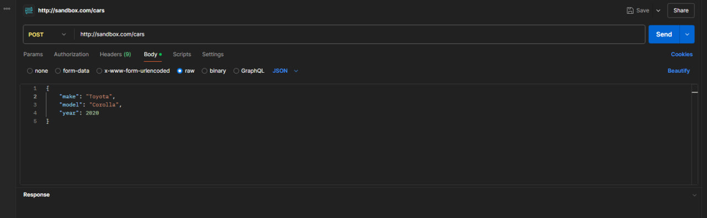   

3. #### Составьте PUT-запрос к серверу по адресу http://sandbox.com/cars/1, указав в заголовке User-Agent ваше имя и фамилию, в заголовке Content-Type значение application/json и в теле запроса следующие параметры: json {    "make": "Toyota", "model": "Corolla", "year": 2021 } .  
   Для составления этого запроса, проделываю ранее сделанные действия, за исключением ввода новых необходимых мне данных в теле запроса и добавляю также новый заголовок Content-Type   
   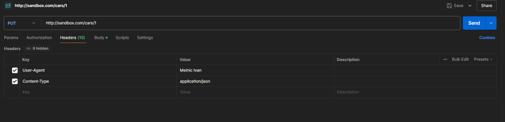   
   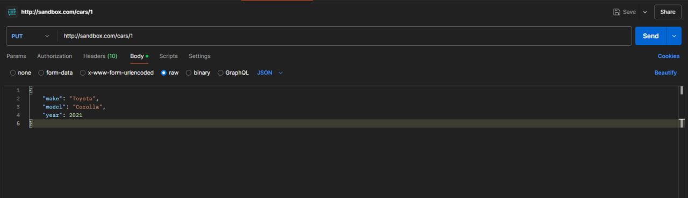   

4. #### Напишите один из возможных вариантов ответа сервера следующий запрос. http POST /cars HTTP/1.1 Host: sandbox.com Content-Type: application/json User-Agent: John Doe model=Corolla&make=Toyota&year=2020 Предположите    ситуации, когда сервер может вернуть HTTP-коды состояния 200, 201, 400, 401, 403, 404, 500.  
   Один из возможных вариантов ответа сервера на запрос "http POST /cars HTTP/1.1 Host: sandbox.com Content-Type: application/json User-Agent: John Doe model=Corolla&make=Toyota&year=2020" может выглядеть приблизительно      так:   
   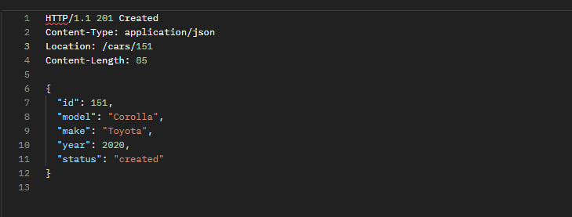   
   Если кратко описать ответ, то мы передаем серверу некоторую информацию о машине, сервер, к примеру, создает новую запись в базе данных и возращает нам ответ, в котором указан код 201 Created, что означает успешное    
   создание. 
   * Если сервер возвратил нам HTTP-код состояния 200, это говорит нам о успешном выполнении запроса. То есть, к примеру, если мы запросили у сервера страницу с подробной информацией о некоторой машине, сервер успешно 
   предоставил необходимую нам информацию и вернул соответствующий HTTP-код 200.
   * В случае, если мы отправили серверу, например, метод POST, для создания новой записи в Базе Данных, в теле запроса указали необходимые данные, сервер обработал эти данные без ошибок и создал новую запись в БД, в         таком случае в ответе клиенту будет указан HTTP-код 201 Created
   * Если клиенту был возвращен HTTP-код 400, это сигнализирует о том, что сервер не понял чего от него хотят, вероятнее всего в запросе была допущена ошибка. К примеру пользователь мог указать неправильный метод запроса    (вместо POST он указал GET), в такой ситуации сервер точно возвратит HTTP-код 400
   * HTTP-код 401 Unauthorized может возникнуть в ситуации, если пользователь запрашивает доступ к определенной странице не будучи авторизованным. К примеру, я пытаюсь попасть на страницу со списком всех моих друзей          Facebook, предварительно не авторизовавшись. В такой ситуации сервер не позволит нам получить доступ к странице и в ответе клиенту возвратит HTTP-код 401 Unauthorized.
   * HTTP-код 403 возникает в ситуации, когда клиент делает запрос к ресурсу, доступ к которому запрещен. Сервер понял запрос, но не выполнит его.
   * HTTP-код 404 говорит о том, что по нашему запросу серверу ничего не удалось найти. Возможно был неправильно указан URL-адрес.
   * HTTP-код 500 говорит нам о том, что произошла ошибка на стороне сервера, то есть, возможно, при обработке полученных данных в функциональности сервера произошла ошибка, в результате чего произошел сбой. В таком    
   случае сервер возвращает клиенту  HTTP-код 500 Internal Server Error.

### Задание №3. Дополнительное задание. HTTP_Quest
1. #### Отправьте POST-запрос на сервер по адресу http://sandbox.usm.md/quest, указав в заголовке User-Agent вашу фамилию и имя (Например User-Agent: John Doe).   
   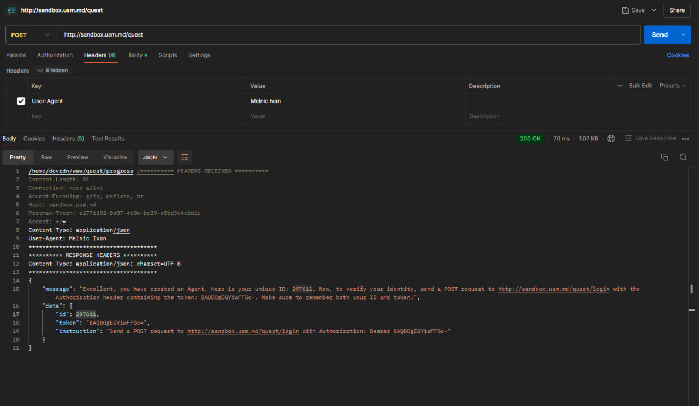   

2. #### Следуйте инструкциям на сервере, выполняя их по порядку.
   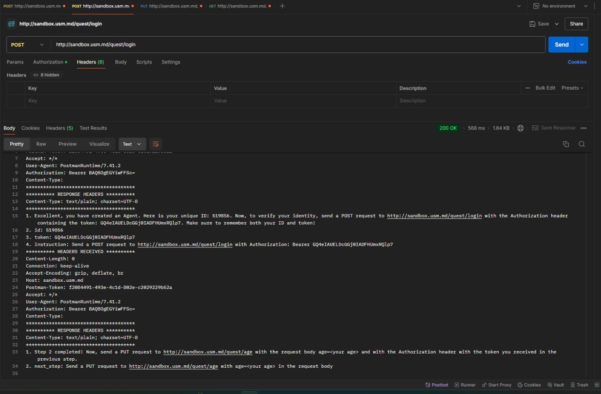   
   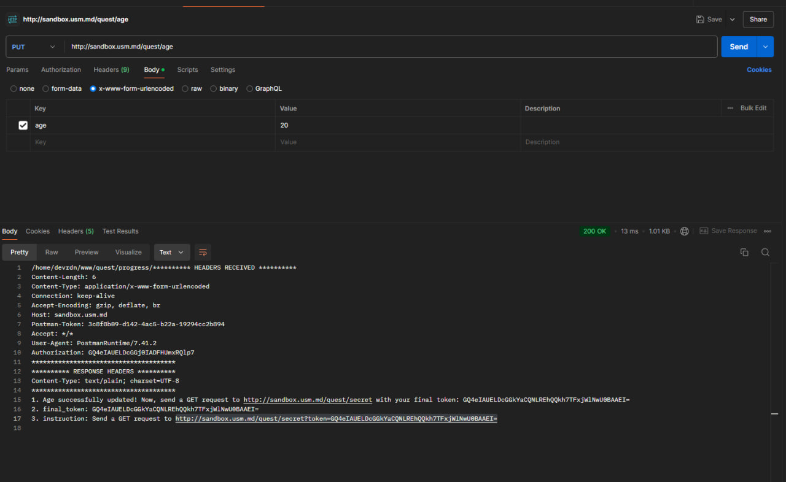   

3. #### В конце квеста Вам будет показано секретное слово, которое Вы должны будете предоставить в отчете.
   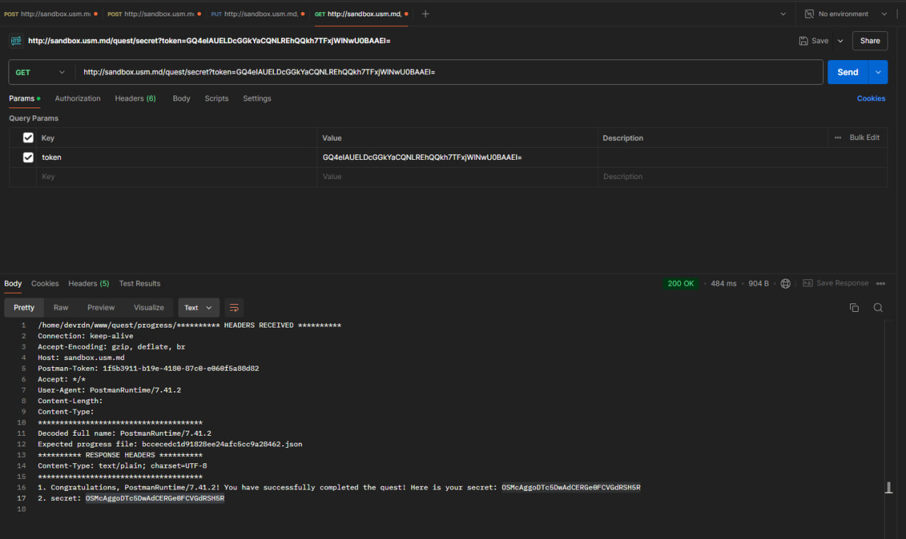   
