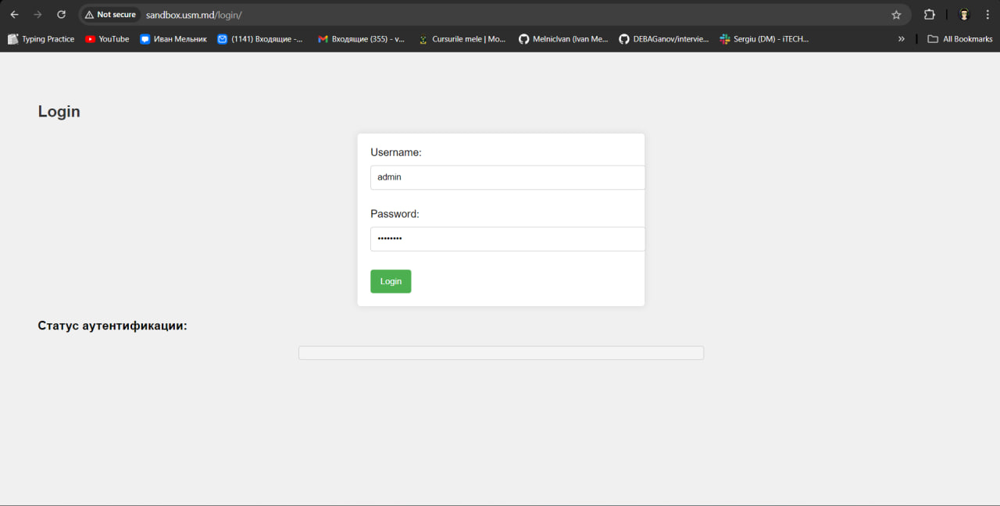
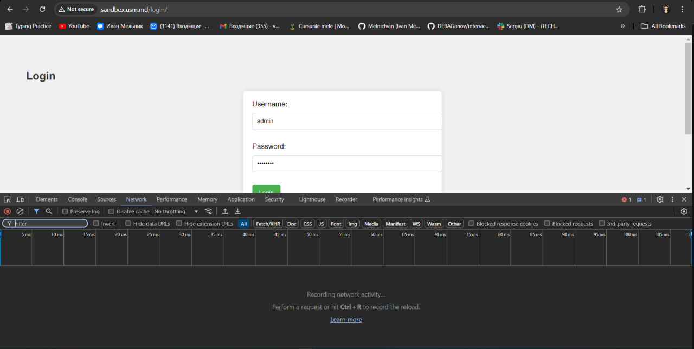
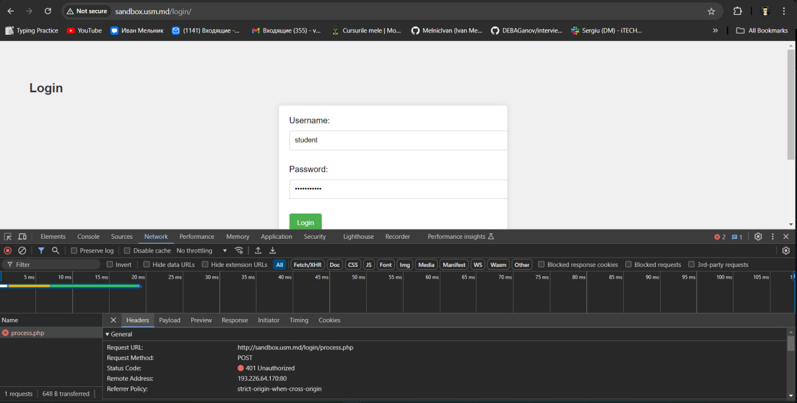
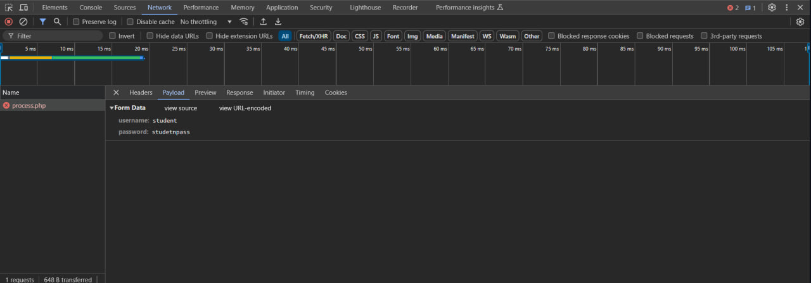
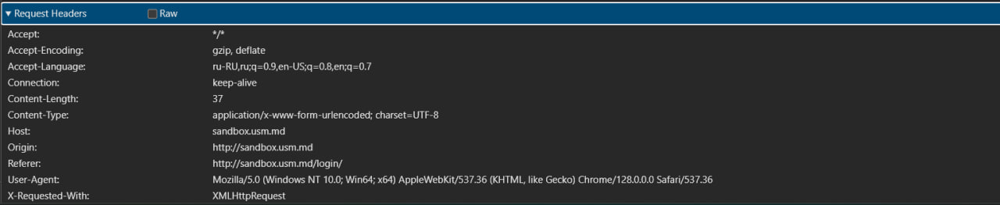
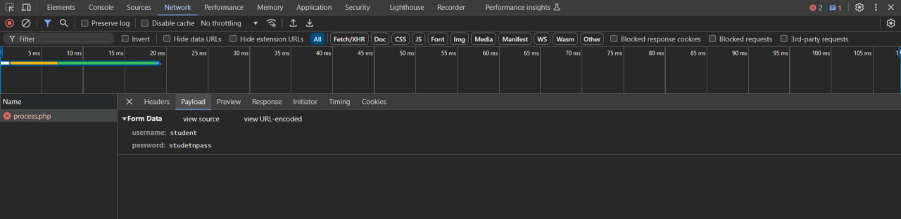
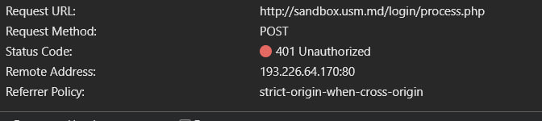
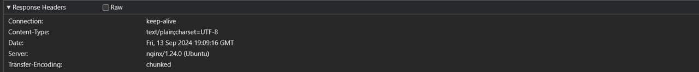

## Лабораторная Работа №1. Основы HTTP.

### Задание №1. Анализ HTTP-запросов
1. #### Зайдите на сайт http://sandbox.usm.md/login.  
   Вводим необходимый URL-адрес в поисковую строку и оказываемся на нужном нам сайте:    
     

2. #### Откройте вкладку Network в инструментах разработчика браузера.    
     

3. #### Введите неверные данные для входа (например, username: student, password: studentpass).   
   Вводим в поля формы неверные данные и наблюдаем результат:    
     

4. #### Проанализируйте запросы, которые были отправлены на сервер.  
   Как видно на рисунке ниже, был отправлен 1 запрос на сервер, который завершился неудачно. Также указан payload, который отправлялся в запросе:    
     

5. #### Ответьте на следующие вопросы:  
   * ##### Какой метод HTTP был использован для отправки запроса?  
     Для отправки запроса был использован метод POST  
   * ##### Какие заголовки были отправлены в запросе?  
     В запросе были отправлены следующие заголовки:  
       
   * ##### Какие параметры были отправлены в запросе?  
      В запросе были отправлены 2 параметра: username, password  
       
   * ##### Какой код состояния был возвращен сервером?  
     Сервер возвратил код состояния 401 Unauthorized  
       
   * ##### Какие заголовки были отправлены в ответе?  
     В ответе были отправлены следующие заголовки:  
       

