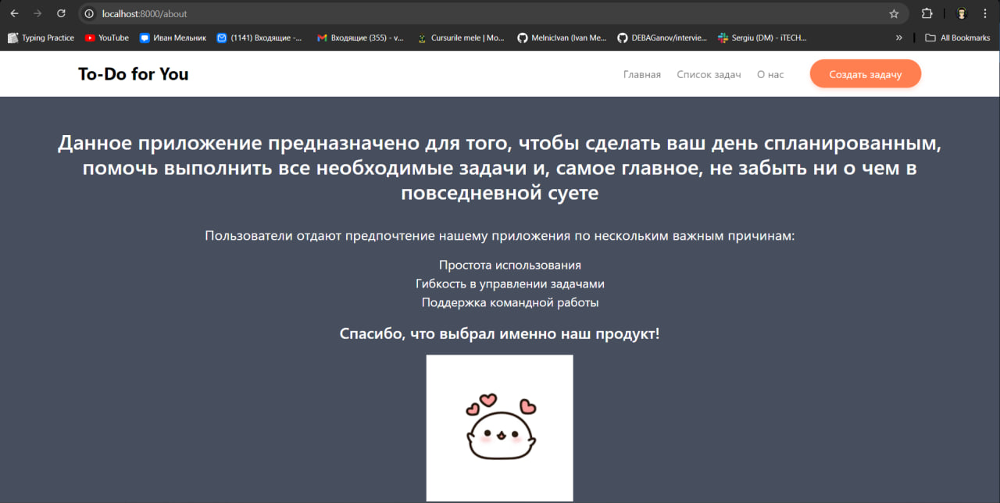

## Лабораторная работа №2. HTTP-запросы и шаблонизация в Laravel

### №1. Подготовка к работе, установка Laravel

1. #### Откройте терминал и создайте новый проект Laravel с именем `todo-app` (имя проекта может быть любым) с помощью Composer: `bash composer create-project laravel/laravel:^10 todo-app`: <br>
    <br>

3. #### Запустите встроенный сервер Laravel: `bash php artisan serve` Вопрос: Что вы видите в браузере, открыв страницу `http://localhost:8000`? <br>
    <br>
   После того, как я вписал в адресную строку `http://localhost:8000` , на экран был выведен следующий результат: <br><br>
    <br>

### №2. Настройка окружения

1. #### Откройте файл `.env` и укажите следующие настройки приложения: 
    - APP_NAME=ToDoApp 
    - APP_ENV=local
    - APP_KEY= 
    - APP_DEBUG=true 
    - APP_URL=http://localhost:8000
   
   В главной директории проекта находим файл `.env` , который содержит переменные окружения и указываем необходимые нам
   значения соответствующим переменным:<br><br>
    <br>

2. #### Сгенерируйте ключ приложения, который будет использоваться для шифрования данных: `bash php artisan key:generate`.  **Вопрос**: Что будет, если данный ключ попадет в руки злоумышленника?

   Выполним генерацию ключа при помощи указанной ранее команды: <br><br>
    <br><br>
   В случае, если ключ, сгенерированный командой `php artisan key:generate`, попадет в руки злоумышленников, это
   поставит под угрозу всю безопасность вашего веб-приложения, так как именно этот ключ используется для шифрования
   конфиденциальной информации, и в случае если им завладеют посторонние люди,
   у них будет возможность расшифровать эти самые конфиденциальные данные. В список таких конфиденциальных данных
   входят: переменные сессий пользователей, токены доступа, cookie и т.д.
   Имея доступ к этим секретным данным, злоумышленник сможет подменять токены аутентификации, просматривать переменные
   сессии, в которых хранятся важные данные об аккаунте, просматривать информацию, содержащуюся в файлах cookie и т.д.

## №3 Основы работы с HTTP-запросами

### №3.1 Создание маршрутов для *"Главная"* страницы и страницы *"О нас"*
1. #### Создайте класс-контроллер `HomeController` для обработки запросов на главную страницу.
2. #### Добавьте метод `index` в `HomeController`, который будет отвечать за отображение главной страницы.
3. #### В этом же контроллере `HomeController` создайте метод для страницы *"О нас"*.
 <br><br>

5. #### Создайте маршрут для главной страницы в файле `routes/web.php. php public function index() { return view('home'); }`
6. #### Добавьте маршрут для страницы *"О нас"* в файле `routes/web.php`.
 <br><br>

Откройте браузер и перейдите по адресу `http://localhost:8000`. Убедитесь, что загружается пустая страница, так как представление `home.blade.php` пока не создано: <br><br>
 <br><br>

### №3.2. Создание маршрутов для задач

1. #### Создайте класс-контроллер `TaskController` для обработки запросов, связанных с задачами, и добавьте следующие методы:
    - **index** — отображение списка задач;
    - **create** — отображение формы создания задачи;
    - **store** — сохранение новой задачи;
    - **show** — отображение задачи;
    - **edit** — отображение формы редактирования задачи;
    - **update** — обновление задачи;
    - **destroy** — удаление задачи.
   
 <br><br>
**Примечание**: Пока мы не изучили работу с формами и запросами **POST** и **PUT**, методы **store**, **create**, **edit**, **update**, **destroy** оставьте пустыми. Мы вернемся к ним позже в курсе. В данный момент сосредоточимся на отображении информации. <br><br>

2. #### Создайте маршруты для методов контроллера `TaskController` в файле `routes/web.php` и укажите правильные **HTTP**-методы для каждого маршрута.
3. #### Используйте группирование маршрутов для контроллера `TaskController` с префиксом `/tasks`, чтобы упростить маршрутизацию и улучшить читаемость кода.
4. #### Определите правильные имена маршрутов для методов контроллера `TaskController`, например:
    - **tasks.index** — список задач;
    - **tasks.show** — отображение отдельной задачи.
    - **...**

 <br><br>

5. #### Добавьте валидацию параметров маршрута `id` для задач. Убедитесь, что параметр `id` — это положительное целое число. Используйте метод `where`, чтобы ограничить значения для параметра `id`.
 <br><br>

6. #### Вместо ручного создания маршрутов для каждого метода можно использовать ресурсный контроллер, который автоматически создаст маршруты для всех *CRUD*-операций:
    - В файле `routes/web.php` замените ручное создание маршрутов для контроллера `TaskController` на ресурсный контроллер: `php Route::resource('tasks', TaskController::class);`
    - **Вопрос**: Объясните разницу между ручным созданием маршрутов и использованием ресурсного контроллера. Какие маршруты и имена маршрутов будут созданы автоматически?

     <br><br>
   
   Использование ресурсного контроллера упрощает маршрутизацию и уменьшает количество кода, что делает его предпочтительным
   выбором для стандартных **CRUD**-операций. Ручное создание маршрутов более гибкое, но требует больше времени и усилий.

7. #### Проверьте созданные маршруты с помощью команды `php artisan route:list`.

 <br><br>

## №4. Шаблонизация с использованием Blade

### №4.1. Создание макета страницы

1. #### Создайте макет основных страниц `layouts/app.blade.php` с общими элементами страницы:
    - Заголовок страницы;
    - Меню навигации;
    - Контент страницы.
   
2. #### Используйте директиву `@yield` для определения области, в которую будут вставляться содержимое различных страниц.
    **Файл** `app.blade.php`:
```blade
<!DOCTYPE html>
<html lang="en">
<head>
    <meta charset="UTF-8">
    <meta name="viewport" content="width=device-width, initial-scale=1.0">
    <title>@yield('title') - ToDo Everyday</title>
    <link rel="stylesheet" href="{{ asset('css/app.css') }}">
    <link rel="stylesheet" href="{{asset('libs/bootstrap-reboot.min.css')}}">
    <link rel="stylesheet" href="{{asset('libs/bootstrap-grid.min.css')}}">
    <link rel="preconnect" href="https://fonts.gstatic.com">
    <link href="https://fonts.googleapis.com/css2?family=Noto+Sans:ital,wght@0,400;0,700;1,400&display=swap"
          rel="stylesheet">

</head>
<body>

<nav class="navbar">
    <div class="container">
        <x-header :title="'To-Do for You'"/>
        <div class="navbar-wrap">
            <ul class="navbar-menu">
                <li><a href="{{ url('/') }}">Главная</a></li>
                <li><a href="{{ route('tasks.index') }}">Список задач</a></li>
                <li><a href="{{ url('/about') }}">О нас</a></li>
            </ul>

            <a href="{{ route('tasks.create') }}" class="callback">Создать задачу</a>
        </div>
    </div>

</nav>

<div class="content">
    @yield('content')
</div>

</body>
</html>
```

### №4.2. Использование шаблонов Blade

1. #### Создайте представление для главной страницы `home.blade.php` с использованием макета `layouts/app.blade.php` в каталоге `resources/views`.
2. #### На главной странице должно быть:
    - **Приветственное сообщение**: заголовок и краткое описание приложения, например "To-Do App для команд".
    - **Навигация**: ссылки на основные разделы, такие как:
      - Список задач;
      - Создание задачи.
3. #### **Информация о приложении**: краткое описание назначения приложения и его основных функций.

```blade
@extends('layouts.app')

@section('title', 'Главная')

@section('header', 'Добро пожаловать в To-Do App для команд')

@section('content')
    <header class="header">
        <div class="container">
            <div class="row">
                <div class="col-lg-8 offset-lg-2 header-content">
                    <h1>Начни планировать свой день прямо сейчас!</h1>
                    <h4>И подстрой время под себя</h4>
                    <a class="btn-main" href="{{ route('tasks.index') }}">Список задач</a>
                </div>
            </div>
        </div>
        <div class="overlay"></div>
    </header>
@endsection
```

3. #### Создайте представление для страницы *"О нас"* — `about.blade.php` с использованием макета `layouts/app.blade.php` в каталоге `resources/views`.

```blade
@extends('layouts.app')

@section('title', 'О нас')

@section('header', 'О нашем приложении')

@section('content')
    <div class="about-section">
        <h2>Данное приложение предназначено для того, чтобы сделать ваш день спланированным,
            помочь выполнить все необходимые задачи и, самое главное, не забыть ни о чем в повседневной суете</h2> <br>
        <p class="about-description">Пользователи отдают предпочтение нашему приложения по нескольким важным причинам:</p>
        <ul class="our-advantages">
            <li>Простота использования</li>
            <li>Гибкость в управлении задачами</li>
            <li>Поддержка командной работы</li>
        </ul>
        <p class="about-gratitude">Спасибо, что выбрал именно наш продукт!</p>
        <div class="about-image"></div>
    </div>
@endsection
```

4. #### Создайте представления для задач со следующими шаблонами в каталоге `resources/views/tasks`:
    - **index.blade.php** — список задач;
    - **show.blade.php** — отображение задачи;
    - **...**
   
**Файл** `show.blade.php`:
```blade
@extends('layouts.app')

@section('title', 'Просмотр задачи')

@section('content')
    <div class="task">
    <h2>{{ $task['title'] }}</h2>
    <p>{{ $task['description'] }}</p>
    <p><strong>Статус:</strong> {{ $task['status'] }}</p>
    <p><strong>Приоритет:</strong> <x-priority :priority="$task['priority']" /></p>
    <p><strong>Исполнитель:</strong> {{ $task['assignment'] }}</p>
    <p><strong>Дата создания:</strong> {{ $task['created_at'] }}</p>
    <p><strong>Дата обновления:</strong> {{ $task['updated_at'] }}</p>

    <div class="actions">
        <a class="redo-btn" href="{{ route('tasks.edit', $task['id']) }}">Редактировать</a>
        <form action="{{ route('tasks.destroy', $task['id']) }}" method="POST" style="display:inline-block;">
            @csrf
            @method('DELETE')
            <button class="del-btn" type="submit" onclick="return confirm('Вы уверены?')">Удалить</button>
        </form>
    </div>
</div>
@endsection
```

5. #### Отрендерите список задач на странице `index.blade.php` с использованием статических данных, передаваемых из контроллера с помощью директивы `@foreach`.

**Файл** `index.blade.php`:
```blade
@extends('layouts.app')

@section('title', 'Список задач')

@section('header', 'Все задачи')

@section('content')
    <h3 class="table-title">Список задач</h3>
    <table class="todo-table">
        <tr class="todo-table-row-title">
            <th>Название</th>
            <th>Описание</th>
            <th>Статус</th>
            <th>Приоритет</th>
        </tr>
        @foreach($tasks as $task)
            <tr class="todo-table-row">
                <th><a class="task-link" href="{{ route('tasks.show', $task['id']) }}">{{ $task['title'] }}</a></th>
                <th>{{ $task['description'] }}</th>
                <th>{{ $task['status'] }}</th>
                <th><x-priority :priority="$task['priority']" /></th>
            </tr>
        @endforeach
    </table>
@endsection
```


### №4.3. Анонимные компоненты Blade

1. #### Создайте анонимный компонент для отображения `header`. Используйте созданный компонент
   #### в макете `layouts/app.blade.php`:

```blade
<a href="#" class="navbar-brand">{{ $title }}</a>
```

```blade
<nav class="navbar">
    <div class="container">
        <x-header :title="'To-Do for You'"/>
        <div class="navbar-wrap">
            <ul class="navbar-menu">
                <li><a href="{{ url('/') }}">Главная</a></li>
                <li><a href="{{ route('tasks.index') }}">Список задач</a></li>
                <li><a href="{{ url('/about') }}">О нас</a></li>
            </ul>

            <a href="{{ route('tasks.create') }}" class="callback">Создать задачу</a>
        </div>
    </div>
</nav>
```

2. #### Создайте анонимный компонент для отображения задачи:
    #### 2.1 Компонент должен быть простым и использовать передаваемые параметры с помощью  директивы `@props`. Это сделает шаблоны более гибкими и переиспользуемыми на различных страницах.
    #### 2.2 Компонент должен отображать информацию о задаче (Название задачи, Описание задачи, Дата создания задачи, Дата обновления задачи, Действия над задачей (редактирование, удаление), Статус задачи(выполнена/не выполнена), Приоритет задачи (низкий/средний/высокий), Исполнитель задачи (Assignment)):

```blade
@props(['task'])

<div class="task">
    <h2>{{ $task['title'] }}</h2>
    <p>{{ $task['description'] }}</p>
    <p><strong>Статус:</strong> {{ $task['status'] }}</p>
    <p><strong>Приоритет:</strong> <x-priority :priority="$task['priority']" /></p>
    <p><strong>Исполнитель:</strong> {{ $task['assignment'] }}</p>
    <p><strong>Дата создания:</strong> {{ $task['created_at'] }}</p>
    <p><strong>Дата обновления:</strong> {{ $task['updated_at'] }}</p>

    <div class="actions">
        <a class="redo-btn" href="{{ route('tasks.edit', $task['id']) }}">Редактировать</a>
        <form action="{{ route('tasks.destroy', $task['id']) }}" method="POST" style="display:inline-block;">
            @csrf
            @method('DELETE')
            <button class="del-btn" type="submit" onclick="return confirm('Вы уверены?')">Удалить</button>
        </form>
    </div>
</div>
```

3. #### Отобразите созданный компонент задачи на странице `show.blade.php` с использованием передаваемых параметров.

```blade
@extends('layouts.app')

@section('title', 'Просмотр задачи')

@section('content')
    <x-task :task="$task" />
@endsection
```

### 4.4. Стилизация страниц

1. #### Добавьте стили для страниц с использованием `CSS` или препроцессоров (например, `Sass` или `Less`).
2. #### Создайте файл стилей `app.css` в каталоге `public/css` и подключите его к макету `layouts/app.blade.php`.

```blade
<link rel="stylesheet" href="{{ asset('css/app.css') }}">
```

3. #### Добавьте стили для элементов страницы, таких как заголовки, меню навигации, кнопки, формы и т. д.

```css
body {
    position: relative;
    font-family: 'Noto Sans', sans-serif;
    font-size: 16px;
    line-height: 1.4;
    color: #000;
    min-width: 320px;
    overflow-x: hidden;
    height: auto;
}

.navbar {
    width: 100%;
    height: 70px;
    box-shadow: 0 4px 10px rgba(0, 0, 0, .1);
}

.navbar .container {
    height: inherit;
    display: flex;
    justify-content: space-between;
    align-items: center;
}
```

4. #### При желании можно использовать библиотеки стилей, такие как `Bootstrap` или `Tailwind CSS`.

```blade

    <link rel="stylesheet" href="{{asset('libs/bootstrap-reboot.min.css')}}">
    <link rel="stylesheet" href="{{asset('libs/bootstrap-grid.min.css')}}">
    <link rel="preconnect" href="https://fonts.gstatic.com">
    <link href="https://fonts.googleapis.com/css2?family=Noto+Sans:ital,wght@0,400;0,700;1,400&display=swap"
          rel="stylesheet">
```

### №5. Дополнительные задания

1. #### Отобразите последнюю созданную задачу на главной странице с использованием `View Composer`.

```blade
<?php

namespace App\Providers;

use Illuminate\Support\ServiceProvider;
use Illuminate\Support\Facades\View;

class AppServiceProvider extends ServiceProvider
{
    /**
     * Register any application services.
     */
    public function register(): void
    {
        //
    }

    /**
     * Bootstrap any application services.
     */
    public function boot(): void
    {
        View::composer('home', function ($view) {
            $tasks = [
                1 => [
                    'id' => 1,
                    'title' => 'Купить продукты',
                    'description' => 'Сходить в магазин и купить продукты',
                    'status' => 'В процессе',
                    'priority' => 'Высокий',
                    'assignment' => 'Иван Иванов',
                    'created_at' => '2024-09-25',
                    'updated_at' => '2024-09-26'
                ],
                2 => [
                    'id' => 2,
                    'title' => 'Закончить проект',
                    'description' => 'Завершить проект для клиента',
                    'status' => 'Ожидается',
                    'priority' => 'Средний',
                    'assignment' => 'Петр Петров',
                    'created_at' => '2024-09-20',
                    'updated_at' => '2024-09-23'
                ]
            ];

            $lastTask = end($tasks);

            $view->with('lastTask', $lastTask);
        });
    }
}
```

2. #### Создайте дополнительный анонимный компонент для отображения приоритета задачи (низкий, средний, высокий) с разными цветами или иконками для каждого приоритета.

    ```blade
    @props(['priority'])

    @if ($priority === 'Высокий')
    <span class="priority high" style="color: red;">&#x1F534; Высокий</span>
    @elseif ($priority === 'Средний')
    <span class="priority medium" style="color: orange;">&#x1F7E0; Средний</span>
    @elseif ($priority === 'Низкий')
    <span class="priority low" style="color: green;">&#x1F7E2; Низкий</span>
    @endif
    ```

## <center>Скриншоты веб-приложения</center>
#### Main Page:
 <br>

#### About_Us Page:
 <br>

#### Task_List Page:
 <br>

#### Task Page:
 <br>

#### Last_Added_Task:
 <br>

<br>

## <center>Контрольные вопросы</center>

1. ### Что такое ресурсный контроллер в `Laravel` и какие маршруты он создает?

    Ресурсный контроллер в `Laravel` позволяет автоматически генерировать базовые методы для работы с различными типами
ресурсов: создание, чтение, обновление и удаление **(CRUD)**. <br>
При использовании команды `php artisan make:controller --resource` создается контроллер с набором методов:

   - **index** — отображение списка ресурсов.
   - **create** — форма для создания нового ресурса.
   - **store** — сохранение нового ресурса.
   - **show** — отображение конкретного ресурса.
   - **edit** — форма для редактирования ресурса.
   - **update** — обновление ресурса.
   - **destroy** — удаление ресурса
2. ### Объясните разницу между ручным созданием маршрутов и использованием ресурсного контроллера.
   *Ручное создание маршрутов:*
   - Требует явного определения каждого маршрута в файле маршрутов.
   - Позволяет гибко настраивать маршруты и методы контроллера.
   
   *Использование ресурсного контроллера:*
   - Автоматически создает стандартные маршруты для операций CRUD.
   - Упрощает код и уменьшает вероятность ошибок.
   - Позволяет быстро настроить базовые маршруты для работы с ресурсами
3. ### Какие преимущества предоставляет использование анонимных компонентов Blade?
    Анонимные компоненты Blade предоставляют следующие преимущества:
    - Упрощение кода: Компоненты можно использовать без явного указания класса, что делает код более чистым и читаемым.
    - Повторное использование: Компоненты можно легко повторно использовать в разных частях приложения.
    - Инкапсуляция логики: Логика отображения может быть инкапсулирована внутри компонента, что улучшает структуру кода и его поддержку.
    - Легкость тестирования: Анонимные компоненты проще тестировать, так как они изолированы от остального кода
4. ### Какие методы HTTP-запросов используются для выполнения операций CRUD?
    Для выполнения операций **CRUD** используются следующие методы **HTTP**-запросов:
    - Create (создание): **POST**
    - Read (чтение): **GET**
    - Update (обновление): **PUT** или **PATCH**
    - Delete (удаление): **DELETE**

   Эти методы позволяют выполнять соответствующие операции на сервере, обеспечивая стандартный способ взаимодействия с ресурсами.
