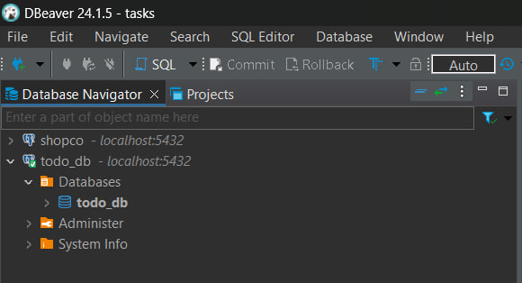
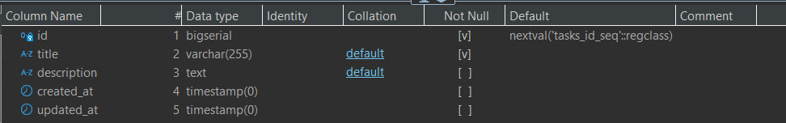
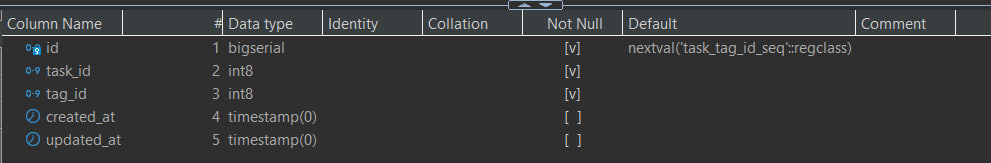
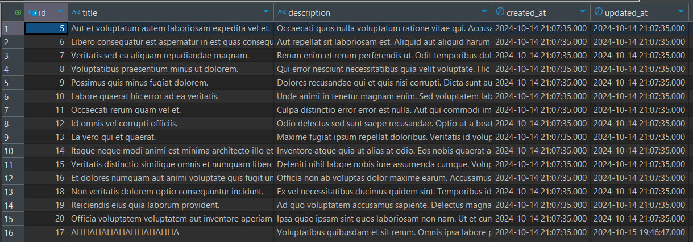
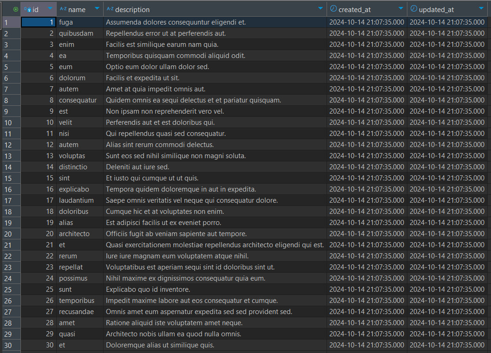
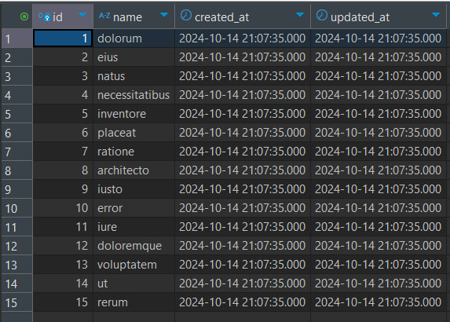

## Лабораторная работа №3. Основы работы с базами данных в Laravel

### №1. Подготовка к работе
1. #### Установите СУБД MySQL, PostgreSQL или SQLite на вашем компьютере.
   В данной лабораторной работе будет использоваться **PostgreSQL**. Для этого в **Docker'e** запустим контейнер, который будет использовать **Image PostgreSQL**. После создания контейнера подключимся к нему.  
2. #### Создание базы данных: Создайте новую базу данных для вашего приложения todo_app.
    <br>
3. #### Настройте переменные окружения в файле .env для подключения к базе данных: env DB_CONNECTION=ваша_бд (mysql, pgsql, sqlite) DB_HOST=127.0.0.1 DB_PORT=3306 DB_DATABASE=todo_app DB_USERNAME=ваш_пользователь DB_PASSWORD=ваш_пароль
```blade
DB_CONNECTION=pgsql
DB_HOST=localhost
DB_PORT=5432
DB_DATABASE=todo_db
DB_USERNAME=ivan
DB_PASSWORD=...
```

### №2. Создание моделей и миграций
1. #### Создайте модель Category — категория задачи. Команда `php artisan make:model Category -m`
   При помощи вышеуказанной команды создадим модель `Category`.
```blade
<?php

   namespace App\Models;

   use Illuminate\Database\Eloquent\Factories\HasFactory;
   use Illuminate\Database\Eloquent\Model;

   class Category extends Model
   {
    use HasFactory;
   }
```

2. #### Определение структуры таблицы category в миграции:
   - Добавьте поля:
      - `id` — первичный ключ;
      - `name` — название категории;
      - `description` — описание категории;
      - `created_at` — дата создания категории;
      - `updated_at` — дата обновления категории.
  
  В файле миграций `create_categories_table`, добавим следующий код, который будет описывать структуру таблицы:
  ```blade
    public function up(): void
    {
      Schema::create('categories', function (Blueprint $table) {
            $table->id();
            $table->string('name');
            $table->text('description')->nullable();
            $table->timestamps();
        });
    }
  ```
3. #### Создайте модель `Task` — задача.
   Создадим модель `Task` при помощи уже ранее использованной команды:
   ```blade
   <?php

    namespace App\Models;

    use Illuminate\Database\Eloquent\Factories\HasFactory;
    use Illuminate\Database\Eloquent\Model;

    class Task extends Model
    {
        use HasFactory;
    }

   ```

4. #### Определение структуры таблицы `task` в миграции:
   - Добавьте поля:
      - `id` — первичный ключ;
      - `title` — название задачи;
      - `description` — описание задачи;
      - `created_at` — дата создания задачи;
      - `updated_at` — дата обновления задачи.

   ```blade 
    public function up(): void
    {
      Schema::create('tasks', function (Blueprint $table) {
      $table->id();
      $table->string('title');
      $table->text('description')->nullable();
      $table->timestamps();
      });
    }
   ```
5. #### Запустите миграцию для создания таблицы в базе данных: `bash php artisan migrate`
    Запустим команду `bash php artisan migrate` и посмотрим на содержимое нашей БД:
 <br>
6. #### Создайте модель `Tag` — тег задачи.
Также при помощи команды `php artisan make:model Tag` создадим модель `Tag`:
```blade 
     <?php

     namespace App\Models;

     use Illuminate\Database\Eloquent\Factories\HasFactory;
     use Illuminate\Database\Eloquent\Model;

     class Tag extends Model
     {
     use HasFactory;

     public function tasks()
     {
         return $this->belongsToMany(Task::class, 'task_tag');
     }
    }

   ```
    
7. #### Определение структуры таблицы `Tag` в миграции:
  - Добавьте поля:
      - `id` — первичный ключ;
      - `name` — название тега;
      - `created_at` — дата создания тега;
      - `updated_at` — дата обновления тега.

    ```blade 
     public function up(): void
     {
        Schema::create('tags', function (Blueprint $table) {
            $table->id();
            $table->string('name');
            $table->timestamps();
        });
      }
    ```

8. #### Добавьте поле `$fillable` в модели `Task`, `Category` и `Tag` для массового заполнения данных.
    Для модели **`Task`** добавим следующую строку в определение класса: `protected $fillable = ['title', 'description', 'category_id'];` <br>
    Для модели **`Category`** добавим следующую строку в определение класса: `protected $fillable = ['name','description'];` <br>
    Для модели **`Tag`** добавим следующую строку в определение класса: `protected $fillable = ['name'];` <br>

### №3. Связь между таблицами
1. #### Создайте миграцию для добавления поля `category_id` в таблицу `task`.
    - `php artisan make:migration add_category_id_to_tasks_table --table=tasks`
    - Определите структуру поля `category_id` и добавьте внешний ключ для связи с таблицей `category`.
    
Пропишем указанную команду и получим следующий созданный файл, здесь же определим структуру полей и внешний ключ для связи с таблицей **`category`**
   ```blade 
   <?php

     use Illuminate\Database\Migrations\Migration;
     use Illuminate\Database\Schema\Blueprint;
     use Illuminate\Support\Facades\Schema;

     return new class extends Migration {
     public function up()
     {
            Schema::table('tasks', function (Blueprint $table) {
                $table->foreignId('category_id')->constrained('categories')->onDelete('cascade');
         });
     }

     public function down()
      {
           Schema::table('tasks', function (Blueprint $table) {
             $table->dropForeign(['category_id']);
             $table->dropColumn('category_id');
             });
     }
   };
   ```

2. #### Создайте промежуточную таблицу для связи многие ко многим между задачами и тегами:
    - `php artisan make:migration create_task_tag_table`

Cоздадим промежуточную таблицу при помощи команды `php artisan make:migration create_task_tag_table`
3. #### Определение соответствующей структуры таблицы в миграции.
    - Данная таблица должна связывать задачи и теги по их идентификаторам.
    - Например: task_id и tag_id: 10 задача связана с 5 тегом.
```blade 
    <?php

     use Illuminate\Database\Migrations\Migration;
     use Illuminate\Database\Schema\Blueprint;
     use Illuminate\Support\Facades\Schema;

     return new class extends Migration
     {
     public function up()
     {
      Schema::create('task_tag', function (Blueprint $table) {
      $table->id();
      $table->foreignId('task_id')->constrained('tasks')->onDelete('cascade');
      $table->foreignId('tag_id')->constrained('tags')->onDelete('cascade');
      $table->timestamps();
      });
     }

     public function down()
     {
         Schema::dropIfExists('task_tag');
     }
    };

   ```
4. #### Запустите миграцию для создания таблицы в базе данных.
Для запуска миграции нам понадобится применить команду `php artisan migrate`
После того, как данная команда сработает, увидим результат в нашей БД:
 <br>

### №4. Связи между моделями
1. #### Добавьте отношения в модель `Category` (Категория может иметь много задач)
   - Откройте модель `Category` и добавьте метод: `php public function tasks() { return $this->hasMany(Task::class); }`
   ```blade
    class Category extends Model
    {
    use HasFactory;

    protected $fillable = ['name','description'];


    public function tasks()
    {
        return $this->hasMany(Task::class);
    }
    }
   ```

2. #### Добавьте отношения в модель `Task`
   - Задача прикреплена к одной категории.
   - Задача может иметь много тегов.
    ```blade
    class Task extends Model
    {
     use HasFactory;
     protected $fillable = ['title', 'description', 'category_id'];

     public function category()
     {
        return $this->belongsTo(Category::class);
     }

     public function tags()
     {
        return $this->belongsToMany(Tag::class, 'task_tag');
     }
    }
   ```

3. #### Добавьте отношения в модель `Tag` (Тег может быть прикреплен к многим задачам)
    ```blade 
    class Tag extends Model
    {
     use HasFactory;

     protected $fillable = ['name'];

     public function tasks()
     {
        return $this->belongsToMany(Task::class, 'task_tag');
     }
    } 
    ```

4. #### Добавьте соотвтествующие поля в `$fillable` моделей.
    После внесения изменений поле `$fillable` для модели **Task** буде выглядеть следующим образом: `protected $fillable = ['title', 'description', 'category_id'];` 

### №5. Создание фабрик и сидов
1. #### Создайте фабрику для модели `Category`:
    - `php artisan make:factory CategoryFactory --model=Category`
    - Определите структуру данных для генерации категорий.

   Применим команду `php artisan make:factory CategoryFactory --model=Category` и получим следующий сгенерированный файл:
    ```blade 
    class CategoryFactory extends Factory
    {
    protected $model = Category::class;

    public function definition()
    {
        return [
            'name' => $this->faker->word(),
            'description' => $this->faker->sentence(),
        ];
    }
    }
    ```
    После генерации файла вносим изменения, которые определяют структуру данных для генерации категорий.
2. #### Создайте фабрику для модели `Task`.
    ```blade
    class TaskFactory extends Factory
    {
     protected $model = Task::class;

     public function definition()
     {
        return [
            'title' => $this->faker->sentence(),
            'description' => $this->faker->paragraph(),
            'category_id' => Category::factory(), // Генерация категории для задачи
        ];
     }
    }
    ```
3. #### Создайте фабрику для модели `Tag`.
    ```blade 
     class Tag extends Model
     {
     use HasFactory;

     protected $fillable = ['name'];

     public function tasks()
     {
        return $this->belongsToMany(Task::class, 'task_tag');
     }
    }
   ```
4. #### Создайте сиды `(seeders)` для заполнения таблиц начальными данными для моделей: `Category, Task, Tag`.
    Создадим `seed'ы` для существующих моделей:
    ```blade 
   class CategorySeeder extends Seeder
   {
     public function run()
     {
       Category::factory(10)->create(); // Создание 10 категорий
     }
   }
    ```
    ```blade 
   class TagSeeder extends Seeder
   {
     public function run()
     {
       Tag::factory(15)->create(); // Создание 15 тегов
     }
   }
    ```
    ```blade 
   class TaskSeeder extends Seeder
   {
     public function run()
     {
       Task::factory(20)->create(); // Создание 20 задач
     }
   }
    ```
5. #### Обновите файл `DatabaseSeeder` для запуска сидов и запустите их: `bash php artisan db:seed`
Обновим файл `DatabaseSeeder`:
```blade 
   class DatabaseSeeder extends Seeder
   {
    /**
     * Seed the application's database.
     */
     public function run()
     {
        $this->call([
            CategorySeeder::class,
            TaskSeeder::class,
            TagSeeder::class,
        ]);
     }
    }
```
Запустим `seed'ы` при помощи соответствующей команды: `php artisan db:seed`. После просмотра содержимого наших таблиц можно заметить, что в каждой из таблиц, для которых были созданы `factory` и `seed'ы`, сгенерировались данные:
Таблица `Tasks`:
 <br>
Таблица `Categories`:
 <br>
Таблица `Tags`:
 <br>

### №6. Работа с контроллерами и представлениями
1. #### Откройте контроллер `TaskController` **(app/Http/Controllers/TaskController.php)**.
    Перейдем в файл `TaskController` по указанному пути.
2. #### Обновите метод `index` для получения списка задач из базы данных.
    - Используйте модель Task для получения всех задач. 
   
    Обновим метод `index`, чтобы данные загружались из БД:
   ```blade 
    public function index()
    {
        $tasks = Task::with(['category', 'tags'])->get();
        return view('tasks.index', compact('tasks'));
    }
   ```
3. #### Обновите метод `show` для отображения отдельной задачи.
    - Отобразите информацию о задаче по ее идентификатору
    - Обязательно отобразите категорию и теги задачи.

    Измененный метод `show` будет выглядеть следующим образом:
    ```blade 
       public function show($id)
    {
        $task = Task::findOrFail($id);
        return view('tasks.show', ['task' => $task]);
    } 
   ```
   Для того, чтобы отдельно отображать информацию о задаче, укажем в качестве параметра `$id` задачи. Внесем изменения в файл `show.blade.php`:
   ```blade 
   @section('content')
    <div class="container mt-4 d-flex justify-content-center">
        <div class="card shadow-lg" style="width: 100%; max-width: 800px; border-radius: 15px; overflow: hidden;">
            <div class="card-header bg-gradient text-white">
                <h4 class="mb-0 text-center">{{ $task->title }}</h4>
            </div>
            <div class="card-body p-4">
                <p class="card-text">{{ $task->description }}</p>

                <p>
                    <strong>Категория:</strong>
                    <span class="badge bg-info">{{ $task->category->name }}</span>
                </p>

                <p>
                    <strong>Теги:</strong>
                    @foreach($task->tags as $tag)
                        <span class="badge bg-secondary">{{ $tag->name }}</span>
                    @endforeach
                </p>
            </div>
            <div class="card-footer bg-light text-end">
                <a href="{{ route('tasks.edit', $task->id) }}" class="btn btn-warning">Редактировать задачу</a>

                <form action="{{ route('tasks.destroy', $task->id) }}" method="POST" class="d-inline-block" onsubmit="return confirm('Вы уверены, что хотите удалить эту задачу?');">
                    @csrf
                    @method('DELETE')
                    <button type="submit" class="btn btn-danger">Удалить задачу</button>
                </form>
            </div>
        </div>
    </div>
   @endsection
   ```
4. #### В методах `index` и `show` используйте метод `with` **(Eager Loading)** для загрузки связанных моделей.
    Добавим использование метода `with` для загрузки моделей, которые имеют связь с `Task`:
    Метод `index`:
    ```blade
    public function index()
    {
      $tasks = Task::with(['category', 'tags'])->get();
      return view('tasks.index', ['tasks' => $tasks]);
    }
    ```
    Метод `show`:
    ```blade
    public function show($id)
    {
      $task = Task::with(['category', 'tags'])->findOrFail($id);
      return view('tasks.show', ['task' => $task]);
    }
    ```
5. #### Обновите соответствующие представления для отображения списка задач и отдельной задачи.
    - Примечание: Поскольку вы ещё не изучали работу с формами, используйте объект `Request` для получения данных. 
    - Например: `php $request->input('title'); // или $request->all();`
    
   Файл `TaskController`:
    ```blade 
   class TaskController extends Controller
   {
     public function index()
     {
     $tasks = Task::with(['category', 'tags'])->get();
     return view('tasks.index', ['tasks' => $tasks]);
     }

     public function home()
     {
        $lastTask = Task::latest()->first();
        return view('home', compact('lastTask'));
     }


     public function create()
     {
        $categories = Category::all();
        $tags = Tag::all();
        return view('tasks.create', compact('categories', 'tags'));
     }

     public function store(Request $request)
     {
        $validated = $request->validate([
            'title' => 'required|string|max:255',
            'description' => 'nullable|string',
            'category_id' => 'required|exists:categories,id',
            'tags' => 'nullable|array',
            'tags.*' => 'exists:tags,id',
        ]);
        $task = Task::create($validated);
        if ($request->has('tags')) {
            $task->tags()->sync($request->input('tags'));
        }
        return redirect()->route('tasks.index')->with('success', 'Задача успешно создана!');
     }

     public function edit($id)
     {
        $task = Task::with('tags')->findOrFail($id);
        $categories = Category::all();
        $tags = Tag::all();

        return view('tasks.edit', compact('task', 'categories', 'tags'));
     }

     public function update(Request $request, $id)
     {
        $validated = $request->validate([
            'title' => 'required|string|max:255',
            'description' => 'nullable|string',
            'category_id' => 'required|exists:categories,id',
            'tags' => 'nullable|array',
            'tags.*' => 'exists:tags,id',
        ]);

        $task = Task::findOrFail($id);
        $task->update($validated);

        if ($request->has('tags')) {
            $task->tags()->sync($request->input('tags'));
        }

        return redirect()->route('tasks.show', $task->id)->with('success', 'Задача успешно обновлена!');
     }

     public function destroy($id)
     {
        $task = Task::findOrFail($id);
        $task->delete();
        return redirect()->route('tasks.index')->with('success', 'Задача успешно удалена!');
     }

     public function show($id)
     {
        $task = Task::with(['category', 'tags'])->findOrFail($id);
        return view('tasks.show', ['task' => $task]);
     }
    } 
   ```
    Обновим страницу с отображением списка задач:
    ```blade 
   @extends('layouts.app')
   @section('content')
   <div class="container mt-4">
      <div class="table-responsive">
          <table class="table todo-table">
                <thead>
                <tr class="todo-table-header">
                <th>Название</th>
                <th style="text-align: center">Описание</th>
                <th>Категория</th>
                <th>Теги</th>
                </tr>
                </thead>
                <tbody>
                    @foreach($tasks as $task)
                       <tr class="todo-table-row">
                        <td>
                            <a class="task-link" href="{{ route('tasks.show', $task->id) }}">{{ $task->title }}</a>
                        </td>
                        <td>{{ Str::limit($task->description, 100) }}</td>
                        <td>{{ $task->category->name }}</td>
                        <td>
                            @foreach($task->tags as $tag)
                               <span class="badge bg-secondary">{{ $tag->name }},</span>
                            @endforeach
                        </td>
                       </tr>
                    @endforeach
                </tbody>
          </table>
      </div>
   </div> 
   @endsection
   ```
   Также внесем изменения в файл с отображением информации о отдельной задаче:
   ```blade 
   @extends('layouts.app')

   @section('content')
   <div class="container mt-4 d-flex justify-content-center">
       <div class="card shadow-lg" style="width: 100%; max-width: 800px; border-radius: 15px; overflow: hidden;">
          <div class="card-header bg-gradient text-white">
              <h4 class="mb-0 text-center">{{ $task->title }}</h4>
          </div>
       <div class="card-body p-4">
            <p class="card-text">{{ $task->description }}</p>
                <p>
                    <strong>Категория:</strong>
                    <span class="badge bg-info">{{ $task->category->name }}</span>
                </p>

                <p>
                    <strong>Теги:</strong>
                    @foreach($task->tags as $tag)
                        <span class="badge bg-secondary">{{ $tag->name }}</span>
                    @endforeach
                </p>
            </div>
            <div class="card-footer bg-light text-end">
                <a href="{{ route('tasks.edit', $task->id) }}" class="btn btn-warning">Редактировать задачу</a>

                <form action="{{ route('tasks.destroy', $task->id) }}" method="POST" class="d-inline-block" onsubmit="return confirm('Вы уверены, что хотите удалить эту задачу?');">
                    @csrf
                    @method('DELETE')
                    <button type="submit" class="btn btn-danger">Удалить задачу</button>
                </form>
            </div>
       </div>
   </div>
   @endsection
   ```
6. #### Обновите метод `edit` для отображения формы редактирования задачи и метод `update` для сохранения изменений в базе данных.
   Внесем изменения в метод `edit`:
    ```blade
    public function edit($id)
    {
        $task = Task::with('tags')->findOrFail($id);
        $categories = Category::all();
        $tags = Tag::all();

        return view('tasks.edit', compact('task', 'categories', 'tags'));
    }
    ```
7. #### Обновите метод `destroy` для удаления задачи из базы данных.
   Внесем изменения в метод `destroy`:
   ```blade
    public function destroy($id)
    {
        $task = Task::findOrFail($id);
        $task->delete();
        return redirect()->route('tasks.index')->with('success', 'Задача успешно удалена!');
    }
    ```

## <center>Контрольные вопросы</center>
1. #### Что такое миграции и для чего они используются?
   Миграции в `Laravel` — это механизм для управления изменениями структуры базы данных с помощью версионирования. 
   Они позволяют легко отслеживать и откатывать изменения в БД, синхронизировать ее состояние с кодом, что упрощает 
   командную разработку и развертывание проекта.
2. #### Что такое фабрики и сиды, и как они упрощают процесс разработки и тестирования?
   Фабрики и сиды упрощают процесс разработки и тестирования, генерируя тестовые данные для моделей и заполняя базу 
   данных заранее определенными значениями. Это помогает разработчикам быстро создавать необходимые данные без 
   необходимости их ручного ввода, ускоряя тестирование и настройку окружения.
4. #### Что такое `ORM`? В чем различия между паттернами `DataMapper` и `ActiveRecord`?
   **ORM (Object-Relational Mapping)** — это способ взаимодействия с базой данных через объекты в коде, без явного 
   использования **SQL-запросов**. `ActiveRecord` связывает модель напрямую с таблицей в базе данных, в то время как 
   `DataMapper` отделяет объекты от логики работы с БД, разделяя их на слои. `ActiveRecord` проще, но `DataMapper` 
   обеспечивает лучшую масштабируемость в сложных системах.
4. #### В чем преимущества использования `ORM` по сравнению с прямыми SQL-запросами?
   Преимущества `ORM` по сравнению с прямыми **SQL-запросами** включают абстрагирование от базы данных, повышение безопасности, 
   кросс-платформенность, работу с отношениями между данными, а также упрощение работы с кодом, так как взаимодействие
   происходит на уровне объектов, а не `SQL`.
5. #### Что такое транзакции и зачем они нужны при работе с базами данных?
   Транзакции — это механизм, позволяющий выполнять несколько операций над базой данных как единое целое. 
   Если одна операция в транзакции не удается, все изменения откатываются, что обеспечивает целостность данных и 
   гарантирует, что они останутся консистентными в случае сбоев.